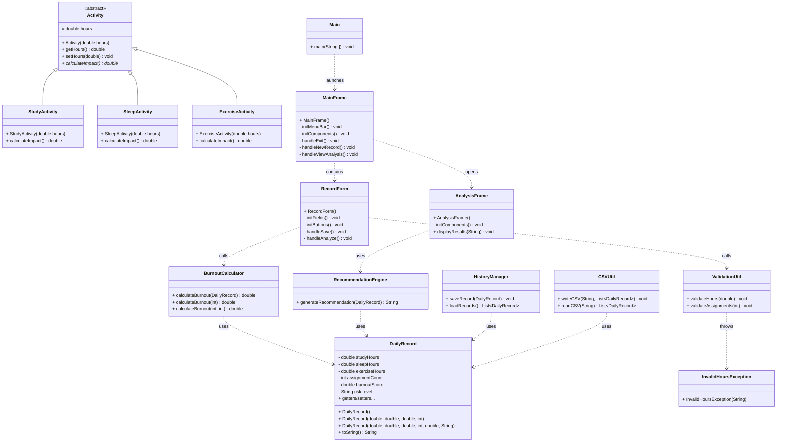

# Class Diagram

```mermaid
classDiagram
    class Activity {
        <<abstract>>
        # double hours
        + Activity(double hours)
        + getHours() double
        + setHours(double) void
        + calculateImpact()* double
    }

    class StudyActivity {
        + StudyActivity(double hours)
        + calculateImpact() double
    }

    class SleepActivity {
        + SleepActivity(double hours)
        + calculateImpact() double
    }

    class ExerciseActivity {
        + ExerciseActivity(double hours)
        + calculateImpact() double
    }

    class DailyRecord {
        - double studyHours
        - double sleepHours
        - double exerciseHours
        - int assignmentCount
        - double burnoutScore
        - String riskLevel
        + DailyRecord()
        + DailyRecord(double, double, double, int)
        + DailyRecord(double, double, double, int, double, String)
        + getters/setters...
        + toString() String
    }

    class BurnoutCalculator {
        + calculateBurnout(DailyRecord) double
        + calculateBurnout(int) double
        + calculateBurnout(int, int) double
    }

    class RecommendationEngine {
        + generateRecommendation(DailyRecord) String
    }

    class HistoryManager {
        + saveRecord(DailyRecord) void
        + loadRecords() List~DailyRecord~
    }

    class InvalidHoursException {
        + InvalidHoursException(String)
    }

    class CSVUtil {
        + writeCSV(String, List~DailyRecord~) void
        + readCSV(String) List~DailyRecord~
    }

    class ValidationUtil {
        + validateHours(double) void
        + validateAssignments(int) void
    }

    class MainFrame {
        + MainFrame()
        - initMenuBar() void
        - initComponents() void
        - handleExit() void
        - handleNewRecord() void
        - handleViewAnalysis() void
    }

    class RecordForm {
        + RecordForm()
        - initFields() void
        - initButtons() void
        - handleSave() void
        - handleAnalyze() void
    }

    class AnalysisFrame {
        + AnalysisFrame()
        - initComponents() void
        + displayResults(String) void
    }

    class Main {
        + main(String[]) void
    }

    %% Inheritance
    Activity <|-- StudyActivity
    Activity <|-- SleepActivity
    Activity <|-- ExerciseActivity

    %% Dependencies
    BurnoutCalculator ..> DailyRecord : uses
    RecommendationEngine ..> DailyRecord : uses
    HistoryManager ..> DailyRecord : uses
    CSVUtil ..> DailyRecord : uses
    ValidationUtil ..> InvalidHoursException : throws
    MainFrame ..> RecordForm : contains
    MainFrame ..> AnalysisFrame : opens
    Main ..> MainFrame : launches
    RecordForm ..> BurnoutCalculator : calls
    RecordForm ..> ValidationUtil : calls
    AnalysisFrame ..> RecommendationEngine : uses
```
